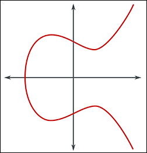
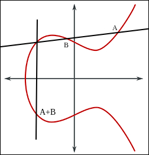
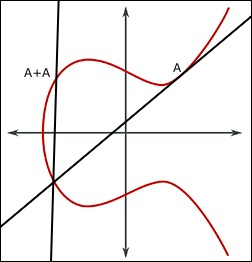
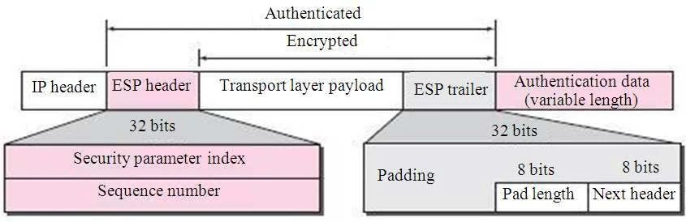

# Introduction to cryptography
### Foundations
#### Number theory
Number theory is a field of mathematics that study the integers (1, 5, 2, 6, -2, -8, -6) (not 5.6, 8.9, 1.4).

Here is some key concept for cryptography :
- A prime number can only be divided by 1 and himself
- A number x is qualify has divisable with y if x mod q = 0 (no rest)
- Some operation are easy to do but hard to reverse

##### Greatest Common Divisor
GCD = Greatest Common Divisor : the greatest common divisor (that does not leave a remainder) between two numbers
```
Divisor of 12 : 1, 2, 3, 4, 6, 12
Divisor of 18 : 1, 2, 3, 6, 9, 18

GCD(12, 18) = 6
```

If GCD = 1 we can say that the number are coprime :
```
7 is prime
20 isnt
GCD(7, 20) = 1

(its work because 20 can't be divided by 7)
```

##### Modular arithmetic
Calculating 10¹²⁸ is very time-consuming. But calculating 10¹²⁸ mod 5 is much simpler thanks to modular exponentiation.

Example with 4⁸ mod 10
```
4 ** 2 = 16
4 ** 4 = (4 ** 2) ** 2 = 16 ** 2 = 256
256 % 10 = 6

4 ** 8 (4 ** 4) ** 2 = Here there's no need to calculate the result, since we already know that 4 ** 4 mod 10 = 6, we can do 6 ** 2 = 36
36 % 10 = 6
```

##### Fermat Theorem
```
(x * 2) mod 101 = 1
```

To find x we can use the Fermat Theorem :
```
2 ** (101-2)
2 ** 99 = 633825300114114700748351602688
633825300114114700748351602688 % 101 = 51
```
```
(51 * 2) mod 101 = 1
```

#### Time complexity

All cryptographic algorithm can be broken, the only question is "can we do it in a reasonable time". This is why in crypto, we want operations that are easy to perform but difficult to reverse.

Problems are classified according to the time required to solve them :

- Polynomial time problems : It just gets a little slower as you increase the size and number of elements.

- Exponential time problems : For example, the possible combinations of x ASCII characters, used by password security.


#### Randomness

Without randomness a message encrypted, will always give the same result. That's why we use sources of randomness, starting with the key.

- salt
- noise
??? how do we get back to the result during decryption if we add noise ?

#### Polynomes
Polynomes are objects that allow data (bytes) to be manipulated in a very structured and invertible way.

A binary value can be represented as a polynomial. This allows for many useful operations in cryptography :
```
01000001
0 * x⁷ + 1 * x⁶ + 0 * x⁵ + 0 * x⁴ + 0 * x³ + 0 * x² + 0 * x¹ + 1 * x⁰
```

### Asymmetric Cryptography
#### RSA
Encryption based on the fact that it is difficult to factor the product of two prime numbers without knowing them.

#### Choose two prime numbers p and q
```
p = 11
q = 13

*Only divisible by 1 and itself.*
```

#### Calculate N
```
N = p * q
N = 11 * 13
N = 143
```

#### Calculate phi(N)
"How many numbers smaller than N share no common divisor with N ?"

Since N is the product of two prime numbers, we can do:
```
phi(N) = (p - 1) * (q - 1)
phi(N) = (11 - 1) * (13 - 1)
phi(N) = 10 * 12
phi(N) = 120
```

#### Find e

Such that ``e`` is coprime with ``phi(N)``; ``e`` and ``phi(N)`` must not share any common divisor other than 1.

```
2 is divisible by 2 and so is 120 | NO
3 is divisible by 3 and so is 120 | NO
7 is divisible by 1 and 7, and 120 is not divisible by 7 | OK
```

---

```
p = 11
q = 13
N = 143
phi(N) = 120
e = 7

public key = (N, e) = (143, 7)
```

---

#### Find d

Such as : ``(e * d) % phi(N) = 1``

```
(7 * d) % 120 = 1
```

To do this, we will test the multiples of 120 + 1:
```
(5 x 120) + 1 = 601
    601 / 7 = 85,85 | NO

(6 x 120) + 1 = 721
    721 / 7 = 103 | OK

(7 * 103) % 120 = 1
```

---
```
d = 103

private key = (N, d) = (143, 103)
```

---

#### Why does it work?

An attacker knows ``N`` and ``e``, but to retrieve ``d``, they would need to find ``phi(N)``, which they can't do without ``p`` and ``q``.
Without ``p`` and ``q``, finding how many numbers smaller than ``N`` share no common divisor with ``N`` would take too much time. The reason we are able to find ``phi(N)`` easily is because ``N`` is the result of ``p * q``, allowing us to use the ``(p - 1) * (q - 1)`` shortcut.

#### Encrypt

```
M = 2 ; the message
```
```
C = 2 ** e % N
C = 2 ** 7 % 143
C = 128 % 143 (0 and remainder 128)
C = 128
```

#### Decrypt

```
M = C ** d % N
M = 128 ** 103 % 143
```

```
$ python3
>>> 128 ** 103 % 143
2

M = 2
```

128 to the power of 103 yields a massive result. To compute it, instead of doing ``128*128*128 etc...``, computers use a technique called modular exponentiation. Here is an example with 4 to the power of 8 mod 10:
```
4 ** 2 = 16
4 ** 4 = (4 ** 2) ** 2 = 16 ** 2 = 256
256 % 10 = 6

4 ** 8 (4 ** 4) ** 2 = no need to calculate the full result here; since we already know that 4 ** 4 mod 10 = 6, we can simply do 6 ** 2 = 36
36 % 10 = 6 # this technique allows the computer to parallelize the calculation.
```

#### ECC (Elliptic Curve Cryptography)
It relies elliptic curves over finite fields. Based on the discrete logarithm problem.

Here is a elliptic curve :



And this is is mathematical representation :
```
y² = x³ + ax + b
```
Let's take two points on this curve: A, B

To calculate the sum of two points on this curve:
- Draw a line through them
- Find the point where this line intersects the curve again
- Find its reflection
- And obtain the value of the sum



To add a point to itself, we just have to take the tangent of this point, and to take its symmetry :



We can call this "A+A" point P.

With only P and A. If you want to know how many times A has been added to itself, you have to recalculate and check if the result is correct. Here, in this case, it's simple because it's only done once. But if you repeat it 1578 times, you have to perform 1578 additions and check if the result is correct.

*But does that mean it takes the same amount of time for the attacker and for us to calculate the result ?* - No, and here is why.

If you want to calculate Ax8, instead of adding the two points (P and A), you can directly add P (A+A) to itself to get A+A+A+A (Ax4). Then you add Ax4 to itself to get Ax8. An attacker won't be able to do it this way because they risk missing the intermediate values (Ax3, Ax6) ​​that might contain the correct result.

This is what is called the discrete logarithm problem.

### Sign with ECDSA
G = generator, point on the curve
e = private key, large number
P = public key, G*e on the elliptic curve
n = the number of times G can be added to itself before returning to the same point

z = hashed message
k = a big secret number, also called nonce (uniq and secret for every signatur) (0 < k < n)

signature = (r, s)

#### Calculate r
```
r = k * G 
-> which gives a point on the curve composed of two coordinates (x, y)
    -> we only keep x

r = x (mod n)
```
#### Calculate s
```
s = k^-1 (z + r * e) (mod n)
```

message provided by the sender : (msg, r, s, P)

#### Verify with the public key
```
w = s^-1 (mod n)

u_1 = z * w (mod n)
u_2 = r * w (mod n)

C = u_1*G + u_2*P
```

If the signature is authentic, the abscissa (the coordinate x) of point C will be equal to r.

#### Diffie-Hellman
We agree on public values:
```
p = a prime number
g = a number
```
```
Alice chose a secret : a
Bob chose a secret : b
```
```
A = g^a mod p
B = g^b mod p

Alice send A, Bob send B.
```

Then each does:
```
Alice calculates: B^a mod p
Bob calculates: A^b mod p
```
```
B^a mod p = A^b mod p = g^(ab) mod p
```
They obtain the same secret key, without having shared it.

Today modern version of Diffie Hellman concept use the same concept but with Elliptic curve.

### Symmetric Cryptography
#### AES

AES (Advanced Encryption Standard) is a symetrical block cipher algorithm. One of the most widely used encryption methods in the world, notably via TLS.

In trivial way, AES is about doing some succesive XOR operations and non-linearity to this system.

Here is a more complete description :

### Chose a secret key, different size are allow : 128, 192, 256
```
key = 11001010 01110101 11100011 00011010
      10101100 01001111 10010110 11101001
      00111100 11010010 01101001 10110100
      01011011 11110000 00010111 10001101
```

### Chose a msg to encrypt
AES only work with 128 bits block (16 bytes). If the size of the block are to short we will use padding.
```
msg = "A secret"

put it in binnary :
msg = 01000001 00100000 01110011 01100101
      01100011 01110010 01100101 01110100
      00000000 00000000 00000000 00000000 these lines
      00000000 00000000 00000000 00000000 are just padding
```

key and msg become 4 by 4 matrices :
```
key = [[11001010 01110101 11100011 00011010],
      [10101100 01001111 10010110 11101001],
      [00111100 11010010 01101001 10110100],
      [01011011 11110000 00010111 10001101]]

msg = [[01000001 00100000 01110011 01100101],
      [01100011 01110010 01100101 01110100],
      [00000000 00000000 00000000 00000000],
      [00000000 00000000 00000000 00000000]]
```

### Caclulate **AddRoundKey**
```
AddRoundKey = msg XOR key
```

So we have to XOR 2 matrices, here is a manual example :
```
A = [ 1010   1100 ]
    [ 0110   0001 ]

B = [ 0101   1010 ]
    [ 0011   1111 ]

C = A XOR B

C[0][0] = 1010 XOR 0101 = 1111
C[0][1] = 1100 XOR 1010 = 0110
C[1][0] = 0110 XOR 0011 = 0101
C[1][1] = 0001 XOR 1111 = 1110

C = [ 1111 0110 ]
    [ 0101 1110 ]
```

```
AddRoundKey result for our key and msg (retrieve with a vibe coded script) :

AddRoundKey = [['10001011', '01010101', '10010000', '01111111'],
               ['11001111', '00111101', '11110011', '10011101'],
               ['00111100', '11010010', '01101001', '10110100'],
               ['01011011', '11110000', '00010111', '10001101']]
```

### AES will then apply turns, each turn containing 4 steps :
```
AES-128 → 10 rounds
AES-192 → 12 rounds
AES-256 → 14 rounds
```

### Step for one turn :
```
SubBytes (S-Box, substitution tables)
ShiftRows
MixColumns
Calculate the new AddRoundKey
```

#### SubBytes (S-Box, substitution tables)

We have a corresponding table. For each byte of our msg we will get the corresponding value in our table :
```
01000001 -> 10111010
00100000 -> 01110111
01110011 -> 00011010
```

In this exemple i use some random value, but in fact the substitution table is generated in a very specific way. The AES S-Box is a table of 256 entries, one for each possible value of a byte (0 to 255).

Example with 01000001 (41) :
```
01000001
GF(2⁸) = “Galois Field of 256 elements"

We then transform the sequence of bits into a polynomial (that is, as a function of their weight): value**location
the 0th bit = 1⁰
the sixth bit = 1⁶

So in GF(2⁸) our byte is equal to x⁶ + 1
```

But here what we are looking for is the reverse of this value in GF(2⁸), B(x) such as : 
```
(x⁶ + 1) × B(x) ≡ 1 (mod x⁸ + x⁴ + x³ + x + 1)
```

Where ≡ designates an equality in a modulo system :
```
A ≡ B (mod m(x))
A and B give the same modulo when divided by m(x).
```

In our example :
```
(x⁶ + 1) × B(x) ≡ 1 (mod x⁸ + x⁴ + x³ + x + 1)

WARNING we are not going to do 1⁶ = 1, here we calculate with polynomials which changes a little the way classical calculations work. In GF(2^8), addition and subtraction are identical and act as a XOR. This means 1 + 1 = 0.
```
```py
import galois

# x^8 + x^4 + x^3 + x + 1 = 1 0001 1011 in binary = 0x11b in hexa
GF = galois.GF(2**8, irreducible_poly=0x11b)

# x^6 + 1 = 65
a = GF(65)

# calcule the reverse of A(x)
b = a**-1

print(f"A(x) : {a}")
print(f"B(x) : {b}")

print(f"B(x) binnary : {bin(int(b))}")
```
```
A(x) : 65
B(x) : 254
B(x) binnary : 0b11111110
```
*(x⁸ + x⁴ + x³ + x + 1) is an irreducible polynomial over GF(2), that mean it cannot be factored into smaller polynomials (in GF(2)).*

We finaly calculate S(x) :
```
S(x) = (A*x) XOR b
x = 00011001
A = fixed 8×8 matrix GENERATED HOW ?
b = constant 01100011 WHERE DOES THIS CONSTANT COME FROM ?

DETAIL OF THE CALCULATION FROM HELL

S(01000001) = 10111010
```

In practice, this isn't calculated manually. We use either a pre-calculated S-box table or an exponentiation algorithm in GF.

There's an inverse S-box to reverse the process.

This adds non-linearity to the encryption. In fact, without S-boxes, AES would be equivalent to a series of easily breakable XOR operations. For example, in XOR:
```
cipher_msg = KEY xor MSG

we can recover the key :
KEY = cipher_msg xor MSG
```
That mean if you only know a part of the message, or with many message you can easely recover the key.


The S-Box break the proprety :
```
S(a xor b) != S(a) xor S(b)

In fact relation between the original value and the value inside of the S-Box are non-linear.
```

#### ShiftRows

We take our new matrix of substitute values ​​and we will simply perform a shift row by row in our matrix. Knowing that for each row number we increase the value of the shift.
```
line 0 -> no shift
line 1 -> 1 shift
line 2 -> 2 shift
```
```
msg = [[a, b, c],
       [d, e, f],
       [g, h, i]]

msg = [[a, b, c], 0 shift
       [e, f, d], 1 shift
       [i, g, h]] 2 shift
```
*I'm not writing the example in binnary because it wouldn't be easy to read.*

Without ShiftRows, each column would remain independent. Therefore, AES would be much easier to break.

#### MixColumns

We take each column of our new matrix. And we multiply each of them by another matrix. This matrix M isn't random, it have been selected by the creators of AES because it's has the property of generating the best result diffusion (MDS : Maximum Distance Separable).

Conceptual example :
```
msg = [[a],
       [e],
       [i]]

M = [
 [02 03 01]
 [01 02 03]
 [01 01 02]
]

new_a = (02 × a) xor (03 × e) xor (01 × i)
new_e = (01 × a) xor (02 × e) xor (03 × i)
new_i = (01 × a) xor (01 × e) xor (02 × i)
```

With values :
```
msg = [[10110110],
       [11110101],
       [00001110]]

M = [
 [02 03 01] # the values ​​are in hexadecimal, but the calculations are done in binary
 [01 02 03]
 [01 01 02]
]

new_10110110 = (02 × 10110110) xor (03 × 11110101) xor (01 × 00001110)
             = (02 × 10110110) xor (03 × 11110101) xor (01 × 00001110)
             = (00000010 × 10110110) xor (00000011 × 11110101) xor (00000001 × 00001110)

new_11110101 = (01 × 10110110) xor (02 × 11110101) xor (03 × 00001110)
new_00001110 = (01 × 10110110) xor (01 × 11110101) xor (02 × 00001110)

WARNING: Since we are working with polynomials here, the × symbol does not represent multiplication. We want to multiply the values ​​according to their position and then handle overflows of more than 8 bytes.

value :    00000010 × 10110110
position : 76543210   76543210

00000010 = x WHY ?
10110110 = x^7 + x^5 + x^4 + x^2 + x
x × (x^7 + x^5 + x^4 + x^2 + x)

x × x^7 = x^8
x × x^5 = x^6
x × x^4 = x^5
x × x^2 = x^3
x × x   = x^2

x^8 + x^6 + x^5 + x^3 + x^2 
```

BUT in GF(256) we cannot go beyond position 7 (which with 0 gives 8 bytes). So we will divide x⁸ into smaller units:
```
x^8 = x^4 + x^3 + x + 1
(x^4 + x^3 + x + 1) + x^6 + x^5 + x^3 + x^2
```
We remove duplicates : x³
```
x^6 + x^5 + x^4 + x^2 + x + 1
position : 76543210
value :    01110111
```
The XOR between the parentheses is quite standard.

#### Calculate the new AddRoundKey

AddRoundKey = current_state XOR RoundKey
RoundKey = is the current AddRoundKey

#### On the last turn

There are no MixColumns.

### Decryption
We do precisely the exact opposite of the process.

#### Reverse ShiftRows
A shift to the right.

#### Get the original value in the S-Box

#### Reverse the MixColumns
Based on the well-known matrix with the highest diffusion rate, if we take its reverse (M^-1): M x M^-1 = Identity matrix, which does nothing. So this is how we reverse the MixColumns process:
```
M^-1 = [[0E, 0B, 0D, 09],
        [09, 0E, 0B, 0D],
        [0D, 09, 0E, 0B],
        [0B, 0D, 09, 0E]]
```

#### Generate the new ReverseRoundKey
As a xor b = c, and c xor a = b, we can as in the encryption process generate the next round key with a xor. This is why AES is a symetrical encryption algorithm.

#### DES

Based on Feistel (https://www.youtube.com/watch?v=FGhj3CGxl8I)

#### Modes
In cryptography, a block cipher mode of operation is an algorithm that uses a block cipher to provide information security such as confidentiality or authenticity. A block cipher by itself is only suitable for the secure cryptographic transformation (encryption or decryption) of one fixed-length group of bits called a block. A mode of operation describes how to repeatedly apply a cipher's single-block operation to securely transform amounts of data larger than a block.

DES or AES define how to encrypt a block, but not how to encrypt an entire message. That's the role of modes like CBC and GCM.

https://www.youtube.com/watch?v=Rk0NIQfEXBA

##### ECB (Electronic Codebook)
Each block is processed independently, without any connection to the others. If two blocks of text are identical, the repetitions remain visible in the ciphertext, which is very dangerous.

Parallelizable.

##### CBC (Cipher Block Chaining)
Each block depends on the previous one. We xor the next block with the current one. The first block is xor with the IV (initial vector) (to prevent issue if first two block are the same in different message).

Not parallelizable.

The problem is also that an attacker can modify the encrypted message. The system can decrypt it correctly, but the original value will no longer be valid. (cf: Bit-flipping attack)

CBC is also vulnerable to the padding oracle attack (cf : Padding oracle).

##### CTR (Counter mode)
Instead of encrypting the message directly, the algorithm will encrypt a sequence of numbers (counters) to generate a stream of pseudo-random data, which is called the Keystream (or key stream).

```
nonce_1, nonce_2 = nonce_1+1, nonce_3 = nonce_1+2

key_1 = cipher(nonce_1, symmetrical_key)
key_2 = cipher(nonce_2, symmetrical_key)
key_3 = cipher(nonce_3, symmetrical_key)
```

```
cipher_block_1 = block_1 XOR key_1
cipher_block_2 = block_2 XOR key_2
cipher_block_3 = block_3 XOR key_3
```

```
cipher_msg = cipher_block_1 + cipher_block_2 + cipher_block_3
```

Parallelizable.

##### GCM (Galois Counter Mode)
The GCM opperation mode is what we call a AEAD mode (Authenticated Encryption with Associated Data). It's an extension of CTR which also guarantees that the encrypted data have not been modified by an attacker.

GCM add a tag to the message (calculated progressively using the key and the message) so we can verify that the data hasn't been modified while it was encrypted. We don't even attempt decryption if the tag is invalid.

To do this, we will generate H such as :
```
null_128_bits = 000000(...) (128 0)
H = cipher(null_128_bits, symmetrical_key)
```

And for each block we will do :
```
H1 = (0 XOR C1) * H (cipher block 1)
H2 = (H1 XOR C2) * H (cipher block 2)
H3 = (H2 XOR C3) * H ...

Where "*" mean a polynomial multiplication in the Galois fields GF(2¹²⁸).
```

Which, thanks to the polynomial nature of the entities with which we calculate, amounts to doing this :
```
Hx = (Cx * H^x)

Where x is the number of cipher block.
```
And this is what it is parallelizable. This is why GCM is called a "PMAC" (Parallelizable message authentication code).

### Hash functions
#### SHA-1
Based on the Merkle-Damgård structure (TO WRITE).

SHA-1 allows hashing blocks of 512 bits. If our block is smaller than 512 bits, we add padding like this:
```
msg = 100111010 (9 bits)
msg = msg + "1"
msg = msg + 0000 * the number of times it takes for a message to have a size of 448

The last 64 bits are reserved to store the length of the original message (in binary).

Original message from 9 bits | 9 = 1001

100111010|10000000000000000000(...)0000|00000(...)1001
msg|padding|length

len(msg|padding) = 448
len(length) = 64
len(msg|padding|length) = 512
```

SHA-1 will involve constants: h0, h1, h2, h3, h4.
```
h0, h1, h2, h3, h4

a = h0
b = h1
c = h2
d = h3
e = h4

for _ in range(80):
    mix(msg, (a, b, c, d, e))

value of a, b, c, d, e have been changed by the mix function.

h0 += a (mod 2³²)
h1 += b (mod 2³²)
h2 += c (mod 2³²)
h3 += d (mod 2³²)
h4 += e (mod 2³²)

New value of h0, h1, h2, h3, h4 are the hash.
```

If the message is larger than 512 bits, we will repeat the process with the updated base values ​​(h).

##### What is in the mix function ?
```
The 512 bits are divided into 16 words of 32 bits:
W0, W1 ... W15

We generate 64 more words, bringing the total to 80 (W16, W17... W79), using XOR operations and rotations on the previous words.

for t in 0...79:
    temp = (a <<< 5) + ft(b, c, d) + e + Kt + Wt (mod 2³²)

(a <<< 5) : Rotate 5 bits to the left
ft : A logical function that changes every 20 rounds
Kt : A constant that also changes every 20 rounds
Wt : The message word corresponding to the current round

Kt : constant like the H values
Round 0-19 : 0x5A827999
Round 20-39 : 0x6ED9EBA1
Round 40-59 : 0x8F1BBCDC
Round 60-79 : 0xCA62C1D6

ft :
Round 0 to 19 : (b AND c) OR (NOT b AND d)
Round 20 to 39 : b xor c xor d
Round 40 to 59 : (b AND c) OR (b AND d) OR (c AND d)
Round 60 to 79 : b xor c xor d
```

##### Why these operations ?
These operations have the property of producing an avalanche effect, meaning that even a tiny change in the original chain produces a completely different result. And the irreversibility created by AND and OR means that it's impossible to go back.

##### How were the constants H and Kt chosen?
They come from the square roots of integers (2, 3, 5, 10) or are simple hexadecimal sequences to prove that there is no "backdoor" in the algorithm.

#### SHA-2
Where SHA-1 is only one algorithm, SHA-2 is a family of hashes containing 32 and 64 bits version :
SHA-224, SHA-256 : 32 bits version
SHA-384 and SHA-512 : 64 bits version (most accurate for x64 CPU)

```
                   SHA-256, SHA-512
Size of the hash : 256,     512
Size of a block :  512,     1024
Number of rounds : 64,      80
```

##### Here is how SHA-256 works :

The generation of the size and the padding is exactly like SHA1

Instead of 5 constants, we have 8 (because the final hash is 256 bits, and 8 * 32 = 256) :
```
h0 ... h7
```

```
a = h0
b = h1
...
h = h7

for _ in range(64):
    mix(msg, (a, b, c, d, e, f, g, h))


Ater the 64 rounds we will update our constants

h0 += a (mod 2³²)
...
h7 += h (mod 2³²)
```

Like in SHA1 the 512 bits are divided into 16 words of 32 bits : 
```
W0, W1 ... W15
```

But the words 16 to 63 arent just generated from XOR operation of the previous one, we use complex rotation functions named littleSigma_0 and littleSigma_1 :
```
for t in 16...63:
    Wt = littleSigma_1(W[t]-2) + W[t]-7 + littleSigma_0(W[t]-15) + W[t]-16

Where W[t]-2 means : The word that was generated 2 steps earlier...
```
*description of the sigma functions at the end*

Rather than having 4 different "Kt" constants, we have 64 (one per round).

The mix function itself is different, for every round we calculate tow temporary value (T1 and T2) :
```
T1 = h + bigSigma_1(e) + Ch(e, f, g) + Kt + Wt
T2 = bigSigma_0(a) + Maj(a, b, c)

h = g
g = f
f = e
e = d + T1 (mod 2³²)
d = c
c = b
b = a
a = T1 + T2 (mod 2³²)
```

Ch function :
```
if e = 1:
    return f
if e = 0:
    return g
```

Maj function :
```
We take the bit that is in the majority between a, b and c.

if a = 0, b = 0 and c = 1:
    return 0
```

Sigma function :
```
littleSigma_0 : (x >>> 7) xor (x >>> 18) xor (x >> 3)
littleSigma_1 : (x >>> 17) xor (x >>> 19) xor (x >> 10)
bigSigma_0 : (x >>> 2) xor (x >>> 13) xor (x >>> 22)
bigSigma_1 : (x >>> 6) xor (x >>> 11) xor (x >>> 25)

>> : right shift
>>> : right rotation

x >> 2 = right shift of 2
01011 >> 2 = 00010

x >>> 2 = right rotation of 2
01001 >>> 2 = 11010
```

#### SHA-3
Based on the Keccak algorithm (TO WRITE).

Padding management :
```
msg = "100111010"
msg += "1"
msg += "000000000(...)"
msg += 1
len(msg) = size of r
```

1600-bit structure :
```
5 * 5 * 64 (a 3D rectangle 64 bits long)

We can call it a sponge.
```

Divide in two parts :
```
r (rate) : visible part with which the message will interact
c (capacity) : hidden part, no direct interaction with the message
```

Initially, this cube is filled with 1600 zeros. We take our message block (which is the size of r) and place it on top of the r part of our cube. We perform an XOR operation between the two. At this stage, the c part of our structure is still 0.

Once we've done that, we'll mix the entire cube like this :
```
for 24 rounds :
    sponge_state = Iota( Chi( Pi( Rho( Theta( sponge_state )))))
```

If the message was larger than the part r, the operation is repeated with what remains and so on in blocks of size r.

##### Details of the operations:

Theta :
For each bit of the cube, we look at the 2 columns surrounding it. We perform an XOR operation on all the bits in these columns, and add the result to the central bit.
```
bit_central_col_2 = 1

col_1 = [ 0, 1, 0, 1, 0 ]
      = 0 ^ 1 ^ 0 ^ 1 ^ 0 = 0 

col_3 = [ 1, 0, 0, 1, 1 ]  
      = 1 ^ 0 ^ 0 ^ 1 ^ 1 = 1 

res = col_1 XOR col_3
res = 0 XOR 1 = 1

bit_central_col_2 = bit_central XOR res
bit_central_col_2 = 1 XOR 1 = 0
```

Rho :
The 64-bit lines are rotated through the depth of the cube. Each wire has a fixed number of rotations to perform, as defined in the standard.
```
a = [ a, b, c, d, e, f ] 

a = Roh(a, 3)

a = [ d, e, f, a, b, c ] 
```

Pi :
```
for each block lines :
    the block (x, y) move to the position : (y, (2x + 3y) mod 5)

Where each letter contains its full 64-bit depth:
cube = [ a, b, c, d, e,
         f, g, h, i, j,
         k, l, m, n, o,
         p, q, r, s, t,
         u, v, w, x, y]

h_pos = (x=2, y=1)
new_x = y = 1

new_y = (2x + 3y) mod 5
new_y = (2 * 2 + 3 * 1) mod 5
new_y = 7 mod 5 = 2

h_new_pos = (x=1, y=2)

cube = [ *, *, *, *, *,
         *, *, *, *, *,
         *, h, *, *, *,
         *, *, *, *, *,
         *, *, *, *, *]

*I put stars in place of the others because they will also change places...
```

Chi :
For each bit, we look at the two next bits on the same line. If the next bit is 0, and the one after that is 1, we invert our bit.
```
a = [ 1, 0, 1, 0, 0 ]
      1, 2, 3, 4, 5,

bit number 1 = 1
the next one (2) = 0
the next one (3) = 1
    so bit 1 become 0

so a become :
a = [ 0, 0, 1, 0, 0 ]
```

Iota :
We take a constant which is different each round, and we do an XOR only on the very first thread of the cube (the 0,0 square and the 64 bits of its depth).

##### Squeezing step (to retrieve the hash)

In SHA3-256 we want a 256 bits hash, so we will take the first 256 bits of the r part of our sponge (in this order : wires (64 bits depth), lines, columns).

If we want a hash larger than r, we can save r, re-perform the 24 steps and thus generate a new r to feed our large hash.

#### Argon2

#### Salt
Without salt, if two users choose the same password, their hashes in the database will be identical. A hacker with a Rainbow Table (a list of pre-calculated hashes) could then identify the passwords instantly.

```
password = "apassword"
salt = "rado4856mdata"
hash = hash(salt || password) # || means concatenate

hash in the database = $rado4856mdata$hashed_value
```

The purpose of the salt is not to be secret. Its purpose is to make mass dictionary attacks impossible, because the attacker would have to recalculate a new hash table for each users.

Ideally, there should be one salt per user.

#### Pepper
It is added to hash like salt, but it is unique and kept secret in a config file or a vault.

```
hash = hash(salt || password || pepper)

hash in the database = $salt$hashed_value (no pepper)
```

When the application wants to verify the hash, it retrieves the pepper and performs the calculation. Therefore, if the database is leaked, the attacker will need the additional pepper to crack the hashes.

#### HMAC
Used in JWTS when we want a stateless authentification, for example :
```
{role: "user", signature}
```
We don't want the user to be able to change their role, so we will calcule the signature in a way that the person who has the key can verify that the content of the message (here the user's role) has not been modified.

You can't just concatenate the message; the key is there because of possible attacks on hashes (see hash vulnerabilities).

This is how we do it :
```
HMAC(K, m) = H( ( K xor opad ) || H( K xor ipad ) || m )

H : the hash function (sha-256 for example)

K : the secret key (if it's longer than the hash block size we hashed it. If it's shorter we filled it with zeros.)

m : the message

|| : concatenation

ipad (inner padding): A repeated constant (0x36)

opad (outer padding): A repeated constant (0x5c)
```

To verify a message we recalculates the HMAC.

##### Why ipad and opad ?
cf : Length Extension attack

#### Hash vulnerabilities and Attack
##### Pre-image attack
This is what attackers actually do when they want to "break/crack" hashes. They want to recover the original value from the hash.

###### Dictionary attack
From a list of common passwords (rockyou for example) an attacker will hash them and compare them with the hash to recover.

###### Brute Force attack
The same thing but without a list and by testing all possible combinations of characters over a defined length.

###### Rainbow Tables attack
Here the attacker will use a pre-calculated hash table.
```
hello = 5d41402abc4b2a76b9719d911017c592
toto = f71dbe52628a3f83a77ab494817525c6
```

This attack is useless if salt is used correctly.

##### Collision
If two different inputs, produce the same result when passed through a hashing algorithm, then a collision has occurred.

Even though it is statistically very rare, certain algorithms (md4, md5, sha1) have known collisions, and this is one of the reasons why they should no longer be used.

Obviously collisions are mathematically obligatory, because a chain of fixed length cannot contain as many possibilities as chains of theoretically infinite length.

##### Second pre-image attack
This is a collision-related attack. The attacker already have a message and is hash. The goal is to find a different message that produce the same hash. The goal here is to create an undetectable substitution.

Imagine a contract that says :
```
"transaction bob -> alice of 5$" hashed value : 1824ea103e837b8558a18f17c8104b9f
```

The hacker will look for a value that produces the same hash, for example by changing the username (he can then create an account with that name.).
```
let's imagine that :
"transaction bob -> anotheraccount of 5$" hashed value is also 1824ea103e837b8558a18f17c8104b9f
```

##### Length Extension attack
If we hash "abc" using an algorithm like SHA-256

Let's assume that one letter = one block for simplicity in this example.

The hash is calculated from successive states; "by block," therefore
```
h('a') -> state -> h('b') -> state -> h('c') -> state

and state is the final hash
```

An attacker can start from the state of the hash and add data, for example "d":
```
state -> h('d')
```

It's not a problem for password verification, but let's imagine our goal is to verify the authenticity of a message...

A naive approach would be:
```
key = "akey"
msg = "transaction bob -> alice of 10"

h( key || msg )
```

Here, nothing prevents an attacker from adding data to the hash that will output from the function and thus increasing the transaction amount :
```
h( key || msg ) -> state

-> state -> h('0000')
```

The other party, wishing to verify the integrity, will have the impression that the transaction is correct:
```
msg = "transaction bob -> alice of 10000"
signature = h( key || msg || "000" )
```

We could do:
```
Hash( msg || key )
```

But to be really sure in HMAC we derive two keys from the main key (so as not to hash the same key twice in the same signature) :
```
HMAC(K, m) =
    H( (K XOR opad) ||
        H((K XOR ipad) || m)
     )
```

##### To fast hashing method
Some hashing methods are too fast (like sha256), which makes them easier for an attacker to calculate. This is why the latest recommendations are to use a slower hashing method like Argon2.

##### Birthday Attack
There is a higher probability of collision than we think. The name of this attack comes from the birthday paradox in probability, where in a group of 23 people there is already more than a 50% chance that two people have the same birthday. This phenomenon seems counterintuitive, but it is based on the fact that we compare all possible pairs, not just one person against all others.

A hashes of a maximum of 8 bits
```
2⁸ = 256 possibilities

hash_list = []

With each new_hash generated:
    if new_hash in hash_list:
        COLLISION
    else :
        hash_list.append(new_hash)
```

The number of comparisons increases very quickly, and so the probability of a collision.

##### Side-channel attack
These flaws are not based on the algorithms themselves but primarily on their implementation and their confrontation with reality.

###### Timing
When a password is hashed and compared to the one in the database, if the loop compares characters one by one and stops when a different one is found, then the hash in the database can be guessed based on the timing.

The fact that internet requests tend to dilute this delay doesn't prevent an attacker from repeating the process multiple times and statistically discovering the data. Furthermore, they can rent a VM in the same data center.

To avoid this, fixed-time comparison functions must be used.

###### Power analysis
A computer consumes more electricity when it processes 0s (0 volts) than 1s (5 volts), that's why by analyzing the electrical consumption we can guess the secret.

When the processor performs a calculation: SHA-256(message) The transistors change state this creates electricity variations. These variations can reveal: internal bits, state of the calculation, secret key (in HMAC).

Simple Power Analysis :
Direct observation of the electrical curve. Some conditional branches create recognizable patterns; the different hash operations are distinguished.

Differential Power Analysis :
Collects thousands of electrical traces, applies statistics, correlates the traces with hypotheses about internal data.

###### Electromagnetic attacks
Instead of measuring the electricity power : we measure the electromagnetic radiation emitted by the CPU.

###### Acoustic attacks
Some physical operations produce microscopic vibrations or sounds and even a hash calculation can produce a usable acoustic signal.

###### Cache attacks
The processor uses a cache to speed up data access. If data is in the cache, access is fast. If not, the processor has to retrieve it from RAM, which is slower. The attacker can measures these time differences to deduce which data has been accessed by the victim.

The goal here is not to read the data used by the victim, but to know which memory address they used. Because the attacker knows, by analyzing the source code of the hashing function (which is public), that, for example :

- If the key bit is 1, the algorithm will get the information in index A.

- If the key bit is 0, the algorithm will get the information in index B.

Flush + Reload : The attacker clears a specific cache entry. They wait for the victim to execute the command, then reload the data. If they reload it quickly, it means the victim has used it. Very precise, but requires sharing files (libraries) with the victim. WHY DIDN'T I UNDERSTAND THIS PART

Prime + Probe : The attacker fills the cache with their own data. They let the victim execute. If the attacker's access to their own data is subsequently slow, it means the victim has "expelled" their data to use that cache space. Precise, requires sharing the same processor, but you monitor your own data.

Evict + Time : The attacker saturates a specific part of the cache to force the processor to empty a precise memory address "X". They then ask the system to calculate an HMAC, for example. If the calculation is slower than usual, it means the processor tried to access "X". If the attacker analyzes the source code and finds that address X is only used when the first bit is "1", then they know the first bit. Less precise but it is the simplest to implement because we simply look at whether the victim slows down or not.

### Cryptographic protocols
### SSL/TLS (Secure Sockets Layer/Transport Layer Security)

Used to create an encrypted and authenticated communication above TCP. 

The objective is to guarantee the confidentiality, the integrity, the authentication (be sure that we are communicating with the correct server), the forward secrecy (if the private key leaks, past traffic remain secret), and the anti-replay protection (prevent message reuse).

#### How it's work (TLS 1.2)
ClientHello
```
TLS version supported by the client
Supported cryptographic suites
Random : a number used to generate sessions key (WHAT DOES THAT MEAN ?)
Extensions : domain requested, protocol requested (HTTP1/2, etc...)
```

ServerHello
```
The server chooses the version of TLS and the cipher suite (depending on the one supported by the client).

The server send is public key, is identity and is CA signature (cf : certification authority). 
```

```
The browser check the certificate and the associated informations (expiration, hostname)
```

Secret exchange step
```
RSA key exchange or DHE/ECDHE
```

#### Versions

Table summarizing the different versions : (AI generated)

| Version | Year  | Key exchange     | Authentication      | Data encryption                        | Integrity     | Forward Secrecy   | Vulnerabilities / remarks                 |
| ------- | ----- | ---------------- | ------------------- | -------------------------------------- | ------------- | ----------------- | ----------------------------------------- |
| SSL 2.0 | 1995  | RSA              | RSA                 | RC2, RC4, DES                          | MD5           | No                | Completely broken today                   |
| SSL 3.0 | 1996  | RSA, DH          | RSA, DSS            | RC4, 3DES, DES                         | MD5, SHA1     | WHAT IS DH ?      | POODLE, downgrade, MAC weak               |
| TLS 1.0 | 1999  | RSA, DHE         | RSA, DSA            | RC4, 3DES, AES                         | HMAC-MD5/SHA1 | Possible          | BEAST, CBC attacks                        |
| TLS 1.1 | 2006  | RSA, DHE         | RSA, DSA            | AES, 3DES                              | HMAC-SHA1     | Possible          | Corrects some CBC attacks                 |
| TLS 1.2 | 2008  | RSA, DHE, ECDHE  | RSA, ECDSA          | AES-GCM, ChaCha20, AES-CBC             | SHA256/384    | Possible          | Dominant modern version                   |
| TLS 1.3 | 2018  | ECDHE            | RSA, ECDSA, Ed25519 | AES-GCM, ChaCha20-Poly1305             | AEAD          | Mandatory         | Simplified and secure handshake           |

#### Why RSA key exchange is no longer used

With RSA key exchange, if an attacker record the TLS traffic, and then break or stole the RSA key, he can decrypt old handshakes recover session keys
and decrypt all past traffic.

With Diffie-Hellman the secret is never transmitted; it is calculated independently by both parties. Even if the server's private key is later leaked: It is impossible to recover the old session secrets.

#### Anti-replay protection

TLS uses sequence numbers and authenticated encryption (AEAD) to prevent packet replay within a connection. Each TLS record is associated with a unique sequence number that is included in the authentication process, so replaying the same encrypted packet would produce an invalid authentication state and be rejected by the server. (cf : HMAC).

#### Attack on SSL/TLS

Beyond the fact that the early versions used cryptographic methods that are no longer up-to-date (RC2, MD5), inherent vulnerabilities in SSL/TLS were discovered:

POODLE : (Padding Oracle On Downgraded Legacy Encryption) is an attack where an attacker (in MITM position) intentionally causes the TLS handshake to fail. At the time, browsers implemented an automatic protocol fallback mechanism: when a handshake failed, they would retry with older versions of TLS/SSL, assuming the server did not support modern versions. Once the connection is downgraded, the attacker exploits a weakness in CBC operation mode and padding management (cf : padding oracle attack), allowing them to retrieve data.

BEAST : TO REDACT

#### Key Schedule TLS 1.3

TLS don't do : ECDHE secret = AES key

It use the ECDHE secret to generate multi-keys with a specific use. This process use HKDF (key derivation function based on HMAC).

MORE DETAIL NEEDED

#### Why TLS 1.3 is faster

TLS 1.2 take multiple Round Trip Time (RTT) before the communication start.

TLS 1.3 merges several steps and often allows 1 RTT or even 0 if the client allready know the server. *How ?* Unlike 1.2, TLS 1.3 supports fewer options for its cipher suite. Therefore, the client can directly send both the cipher suite it supports and the corresponding cryptographic elements (The keyExange trought ECDHE and the "negociation" are embeded).

TLS 1.3 allows a client to re-start an interrupted session with a server by using a PSK (Pre-Shared Key) derived from an earlier connection.. 

The problem is that nothing prevents these requests from being replayed by an attacker, given that the client reuses an old session via a PSK and sends requests directly with it (So even if the same request are replayed twice, the server might think they are just two different sessions). To circumvent the risk, one can disable the 0 RTT for certain routes or methods, or use an anti-replay cache.

#### Mutual TLS

In mutual TLS, the client iself is authenticated trought a CA certificat.

### IPSec (Internet Protocol Security)
Is a protocol suite that secure IP communications by providing the same feature as TLS (confidentiality, integrity, authentication, anti-replay) but in the layer 3. While TLS protects at an application layer, IPsec operates at the IP layer, therefore all applications trought IPSec are automatically protected.

When two machines want to communicate with IPSec, they follow these steps:
- Authenticate each other
- Negotiate security algorithms
- Create encryption keys
- Establish a secure tunnel
- IP packets are then encrypted/authenticated

#### IKE : Key Negotiation
IKEv2 is the standard today.

Authenfication trought pre-shared key (not the most secure option), or with certificat (cf : PKI).

And then Diffie–Hellman key exchange.

#### Security Association (SA) :
Once the keys have been exchanged, we can define a SA for unidirectional communication. If we want clients to be able to communicate with the server and for the server to respond, we define two SA.

An SA is simply a set of security parameters. It contains the key-set generated by IKE, the algorithms to use (AES-GCM, HMAC etc...), the lifetime, and the mode (tunnel/transport).

Each SA has an identifier called Security Parameter Index (SPI). The receiver uses the SPI to determine: which key to use, which algorithm to apply (it retrieves it from his security association database).

#### Authentication Header (AH) :
Allow integrity, authentification and anti-replay by adding a header to the packet contaning a hash of the data (like a HMAC) and a sequence number. Thus, if a bit changes the hash becomes invalid.

The issue here is that the header protect information that need to be change by the nat routing system (like the src ip). That's why AH is rarely used today because ESP can provide integrity, authentication and anti-replay in addition to encryption.

#### Encapsulating Security Payload (ESP) :
Allow encryption, integrity, authentication, anti-replay :



The external IP header remains visible for routing.

Like AH, ESP can operate in Transport mode or Tunnel mode.

In transport mode, the original IP header remains visible. In tunnel mode, the entire IP packet is encapsulated and encrypted during its transit over the internet before being decrypted by the remote VPN gateway and transmitted to the destination host on the protected network.

The advantage of encrypting the IP packet is to mask the internal network and its communications. From the outside, only the public IP addresses of the VPN gateways are visible.

#### NAT-T

NAT devices do not handle native ESP reliably because ESP is not transported over TCP or UDP. Instead, ESP is its own IP protocol (IP Protocol Number 50) carried directly inside IP packets.

| IP Protocol Number | Protocol |
| ------------------ | -------- |
| 1                  | ICMP     |
| 6                  | TCP      |
| 17                 | UDP      |
| 50                 | ESP      |
| 51                 | AH       |

For example, a typical HTTPS packet looks like:

IP -> TCP -> TLS -> HTTP

The IP header contains "Protocol = 6", which tells the receiver that the payload is a TCP segment.

An ESP packet looks like:

IP -> ESP -> Encrypted payload

The IP header contains "Protocol = 50", which tells the receiver that the payload is an ESP packet.

NAT Traversal (NAT-T) solves this problem by encapsulating ESP inside UDP port 4500:

IP -> UDP 4500 -> ESP -> Encrypted payload

The NAT device now sees a normal UDP flow and can handle it correctly.

Why doesn't ESP simply use TCP or UDP like TLS?

Because IPsec is designed to secure IP traffic at Layer 3. ESP therefore operates directly on top of IP rather than on top of TCP, unlike TLS which sits above the transport layer.

#### Security Policy Database (SPD)

Defines which traffic must be protected and which traffic should be bypassed or discarded in a config file in the routeur.

### SSH

### PKI
Public key infrastructure design a set of techniques and organization to guarantee the identity of entities through cryptographic techniques.

The problem is as follows:

During the TLS handshake, the server signe a part of the message with the private key to prove it actually possesses the private key corresponding to the claimed public key. The client can then verify the signature with it.

But how to prove that the key pair held by the server correspond to the claimed domain ? An attacker could manipulate the DNS response, and impersonate a legitimate website by generating a key pair. 

You might think that if Alice sends her public key to Bob, there is no longer any risk because Bob can encrypt a message with that key, and only Alice will be able to read it. However, if the attacker intercepts Alice's public key and replaces it with their own, Bob will encrypt the message with the attacker's key. To make their attack transparent, the attacker can even re-encrypt the message with Alice's key and send it to her. This attack pattern is called a man in the middle attack.

This is where PKI is usefull. It allows us to certify, through a relationship of trust, that the public key truly belongs to the domain.

#### X.509 Certificates

```
Subject: www.example.com

Public Key: ECDSA key

Issuer: Let's Encrypt

Valid from: 2026-01-01

Valid until: 2026-04-01

Signature: AAAAAAAAAAAAAAAbbbb...
```

The certificate that the website will provide contains among other, its domain, its public key and the signature of the certification authority (here Let's Encrypt)

#### Certificate authorities

The certificate authority signed the certificate with its private key. The certificate authority's public key is provided by the website along with its certificate (the CA certificate). This creates a kind of chain of trust, and ultimately the root CA certificate (there are about ten of them worldwide) is hardcoded into the browser.

Things provided by the server :
```
awebsite.net public key + awebsite.net certificate
+ public key of the CA that signed the certificate + certificate of the CA
```

#### OCSP

If a certificate is considered compromised (for example, if the private key has been leaked), CAs used to publish lists of revoked certificates, but this was a slow method. Now, Online Certificate Status Protocol (OCSP) is used.

The browser sends a request to the CA at each connection. However, it's create a privacy risk (the CA knows which site you are visiting).

The method used today is OCSP Stapling. This time, the server will periodically retrieve validation from the CA that its certificate is still valid (the response message will be signed by the CA and therefore cannot be modified by the server).

#### Certificate Transparency (CT)

All Certificate Authorities (CAs) must publish the certificates they issue in public logs to prevent fraudulent validation. To ensure this transparency, when connecting to a website, the browser also verifies that the certificate is recorded on the correct date in these logs.

### Attacks
#### Man-in-the-middle

The most critical situation that cryptography tries to solve is the man-in-the-middle case. When someone between Bob and Alice can view and change the packet they exchange. The best workaround to solve this problem is the Diffie–Hellman key exchange.

#### Bit-flipping attack

https://www.youtube.com/watch?v=VR-TuXXi3A8

The issue with the bit-flipping attack is not a loss of confidentiality, but a loss of integrity. Indeed, block cipher modes such as ECB, CBC or CTR ensure the confidentiality of the data, but do not guarantee its integrity. An attacker capable of modifying the ciphertext can cause predictable changes in the plaintext after decryption.

To guarantee the integrity and authenticity of the data, it is necessary to use an authentication mechanism such as a MAC (for example HMAC) or, preferably, an authenticated mode of operation like GCM.

The problem is as follows (example for CBC with 8-bit blocks to make it simpler) :
```
Data in clear = "admin=0"
Data in binnary = [ 01100001Data after AES-CBC = [ 01100001
                       01100100
                       01101101
                       01101001
                       01101110
                       00111101
                       00110000 ]
                    01100100
                    01101101
                    01101001
                    01101110
                    00111101
                    00110000 ]

Data after AES-CBC = [ 00101111
                       01100110
                       01101101
                       01101001
                       01101110
                       10101101
                       1111011 0 <----- this is the bit to change to become admin ]
```

What an attacker can do is flip the bit values one by one and resend the data each time to test whether they manage to modify the value.
Here it's all the easier because it's the last bit that defines whether the user is admin or not. It's more complicated if the information to be modified is written across several bits in a larger message.

#### Padding oracle

Let's imagine a block cipher algorithm of the AES-CBC type but that would use blocks of max 2 bytes (for the simplicity of the example).

Padding management in AES follows the PKCS#7 convention. (one padding byte = 01, 2 = 02 etc...).

Encryption :
```
data_clear_in_hexa = [
    07, e1,
    a3, c8,
    d5, f1
]

fisrt_block = 07, e1,
second_block = a3, c8,
third_block = d5, f1

first_block_cipher = encrypt_with_aes( ( fisrt_block XOR iv ), key ) 

second_block_cipher = encrypt_with_aes( ( second_block XOR first_block_cipher ), key ) 

third_block_cipher = encrypt_with_aes( ( third_block XOR second_block_cipher ) , key ) 

```

Decryption :
```
first_block_clear = decrypt_with_aes( ( fisrt_block XOR iv) , key) 

second_block_clear = decrypt_with_aes( ( second_block XOR first_block_cipher ), key ) 

third_block_clear = decrypt_with_aes( ( third_block XOR second_block_cipher ), key )
```

The problem arises when we have a padding oracle. Any vulnerability in the application that will allow us to know when the padding of the encrypted message sent by the attacker is correct.

What we'll be able to do is, for example, modify the last byte of second_block until we are told that the padding is correct. This will mean that the last byte of third_block is "01", the only valid padding possible.

If we know that in the configuration we've just created, third_block last byte = "01", then we can recover the clear value of the last byte by performing a XOR between "01" and the value of the last byte of second block (which produced this result).

Example :
```
data_encrypted = [
    e2, c1,
    03, b2,
    a1, a3
]

The attacker modifies the data like this :

for I in 255 possibiliy of an byte :
    data_encrypted = [
        e2, c1,
        03, I,
        a1, a3
    ]
    rep = send_to_oracle(data_encrypted)
    if rep = "padding ok":
        value_last_byte = I xor "01"
```

To get the value of the other bytes, we just need to increase the size of the padding :
```
for I in 255 possibiliy of an byte :
    data_encrypted = [
        e2, c1,
        I, X,
```

But there's no need for 256² possibilities; since we know the last byte of block 2, we know what to put in the last byte of block 1 so that it equals 02 (X).

Regarding the last block, either the padding is known or guessable, or we can't break it with this method.

Python demonstration : (i tried to make it visual using the hexdump functions)
```py
from os import urandom

from base64 import b64encode, b64decode
from binascii import unhexlify, hexlify

from Crypto.Cipher import AES
from Crypto.Util.Padding import pad, unpad

def hexreversedump(candidate: str) -> bytes:
    # generated by gpt-5.3
    left, right = candidate.split("|")

    left = left.strip()
    right = right.strip()

    left_bytes = unhexlify(left.replace(" ", ""))
    right_bytes = unhexlify(right.replace(" ", ""))

    return left_bytes + right_bytes

def hexdump(data, block_size=16):
    # generated by gpt-5.3
    if isinstance(data, str):
        data = data.encode()

    hex_bytes = [f'{b:02x}' for b in data]

    chunks = [
        ' '.join(hex_bytes[i:i+block_size])
        for i in range(0, len(hex_bytes), block_size)
    ]

    return ' | '.join(chunks)

iv = unhexlify("97dc0dd29e556ad14537776bade3e2aa")
password = unhexlify("f93248a1d5cccef329912dbb3430d955")
msg = "a super secret message"

print("MSG                   :", msg)
print("MSG_HEXA              :", hexdump(msg))

msg = pad(msg.encode(), AES.block_size)
print("MSG_HEXA_WITH_PADDING :", hexdump(msg))


cipher = AES.new(password, AES.MODE_CBC, iv)
cipher_text = cipher.encrypt(msg)
print(f"HEX_CIPHER_VERSION    : {hexdump(cipher_text)}")
```
```
MSG                   : a super secret message
MSG_HEXA              : 61 20 73 75 70 65 72 20 73 65 63 72 65 74 20 6d | 65 73 73 61 67 65
MSG_HEXA_WITH_PADDING : 61 20 73 75 70 65 72 20 73 65 63 72 65 74 20 6d | 65 73 73 61 67 65 0a 0a 0a 0a 0a 0a 0a 0a 0a 0a
HEX_CIPHER_VERSION    : 20 5b b4 b7 86 e5 4e 9b 0c 4d 40 8b 44 ba 14 4b | c6 d6 66 33 29 19 6d 76 ab 90 e6 8a bf fa 79 7a

0a = 10, the padding is valide
```

Attackers POV :
```py
def padding_oracle(cipher_text):
    try:
        cipher = AES.new(password, AES.MODE_CBC, iv)
        plaintext = cipher.decrypt(cipher_text)

        unpad(plaintext, AES.block_size)

        return True

    except ValueError:
        return False

# Let's try to get the last byte of the message :
for i in range(256):

    # modify the last byte of the first block of encrypted text
    # why 02x ?
    candidate = f"20 5b b4 b7 86 e5 4e 9b 0c 4d 40 8b 44 ba 14 {i:02x} | c6 d6 66 33 29 19 6d 76 ab 90 e6 8a bf fa 79 7a"
    cipher_candidate = hexreversedump(candidate)
    
    if padding_oracle(cipher_candidate):
        print("Padding ok      :", i)
        i_xor_01 = i ^ 0x01
        clear_last_byte = i_xor_01 ^ 0x4b # 4b was the correct value of the last byte of the first block
        print(f"byte in clear : {hex(clear_last_byte)}")
```
```
Padding ok      : 64
byte in clear : 0xa
Padding ok      : 75
byte in clear : 0x1
```
There are two candidates, which is normal since the padding is also valid with the original value of the last byte of the first block (4b). In this case, when we solve one of them with the following operation :
```
(I xor 01) original_value_of_location I = "0xa" 
```

0xa = 0a is the byte we're looking for, which in this case is padding.

Script to recover everything :
```py
def decrypt_block_2(block_1, block_2):
    # Convert the visual hexadecimal (base 16) representation to integer (base 10) table
    b_origin = [int(x, 16) for x in block_1.split()]
    b2 = [int(x, 16) for x in block_2.split()]

    # This table will be used as storage for the byte we find
    clear = [0] * 16

    # I = 15, 14, 13 etc...
    for I in range(15, -1, -1):
        padding_goal = 16 - I
        temp_b = b_origin.copy()
        
        # The bytes already found allow us to form the beginning of the chain. 
        # For example, if we already know the first byte, we will set it to 02 
        # and we will brute-force the second one until we obtain a valid padding
        for j in range(I + 1, 16): # gpt-5.3
            temp_b[j] = b_origin[j] ^ clear[j] ^ padding_goal # gpt-5.3

        # Brute force of the 256 possibilities of the current bytes
        for i in range(256):
            # Avoid the false positive of the initial padding on the very first byte
            if padding_goal == 1 and i == b_origin[I]: # gpt-5.3
                continue
                
            temp_b[I] = i
            candidate = bytes(temp_b + b2)
            if padding_oracle(candidate):

                clear[I] = i ^ padding_goal ^ b_origin[I]
                break

    return "".join(chr(x) for x in clear)

block_1 = "20 5b b4 b7 86 e5 4e 9b 0c 4d 40 8b 44 ba 14 4b"
block_2 = "c6 d6 66 33 29 19 6d 76 ab 90 e6 8a bf fa 79 7a"
result = decrypt_block_2(block_1, block_2)
```
```
result = "essage"
```
